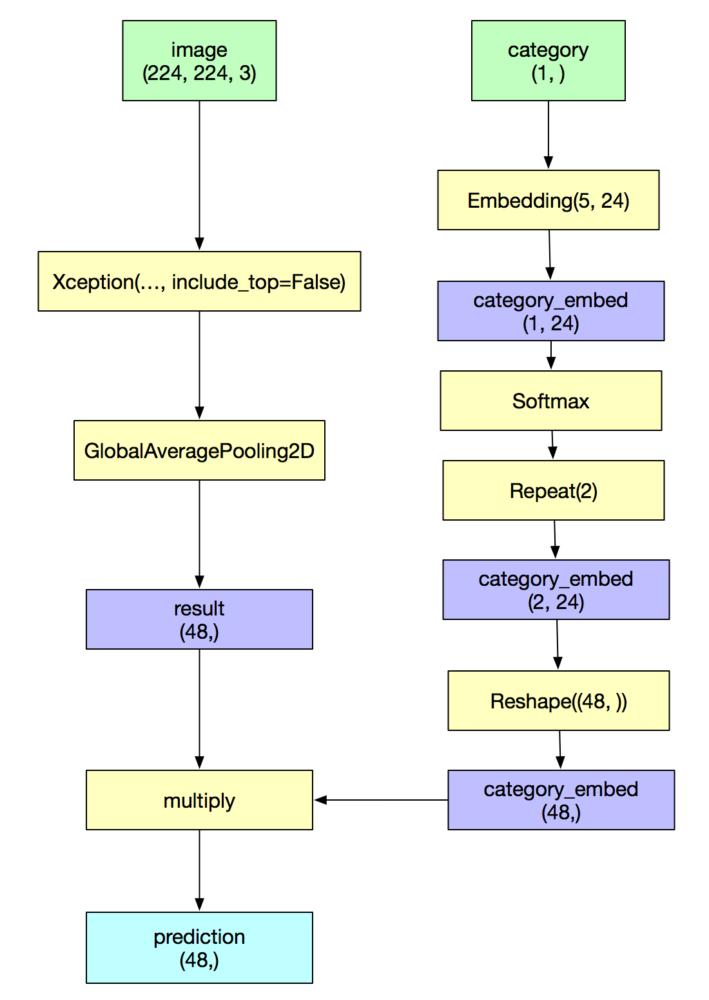
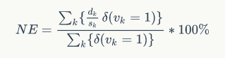

# FashionAI全球挑战赛——服饰关键点定位

[竞赛链接](https://tianchi.aliyun.com/competition/introduction.htm?raceId=231648)

本项目为快速跑通流程的一个原型，可以当成一个 baseline ，线下测试的分数大约为 13% ，
最终线上的成绩为 11.81%，在初赛中排 101 名。项目用 Keras 实现。

## model

模型部分非常简单，直接使用了 `xception net` (不使用预训练好的模型)，对输出层做了微小改动，使其输出直接是
24个坐标点，共48个数值。



## loss

比赛的评分指标用的是 Normalized Error， 其实就是对图片中每个关键点的预测偏差除以了一个归一化参数，
其中上衣外套连衣裙的归一化参数是两个腋窝点的欧式距离，裤子和半身裙的归一化参数是两个裤头的欧式距离。



NE 不直接可导，考虑用 NE 的平方作为 loss。但 NE 平方展开较为复杂，你会发现分子部分实际上有很多二次交叉项，
代码实现起来感觉很繁琐。因此我在实际训练的时候使用的 loss，是直接对
`square error` 做归一化，再求和做平均。

## dataloader

这个步骤比较繁琐，因为数据量还是不小的，无法全部读入内存中，因此把他抽象成一个类来，效果如下:

```python
train_imgs = ImageData(..., source_shape=(512, 512), target_shape=(512, 512)
train_imgs[0]
train_imgs[:100]
```

让 `train_imgs` 像一个 numpy array 一样可以做 index 和 slice，并且会先对图片进行 padding，然后做缩放。


## training

训练的时候把原始训练集按照 9: 1 进行切分，对验证集的 loss 进行监控，当 loss 连续 3 个 epochs 不下降的时候，就
调低 learning rate。当验证集的 loss 连续 5 个 epochs 不下降时，就停止训练。每个 epoch 都查看一下验证集 loss 是否
变小，如果变小了就把当前最好的模型保存起来。
